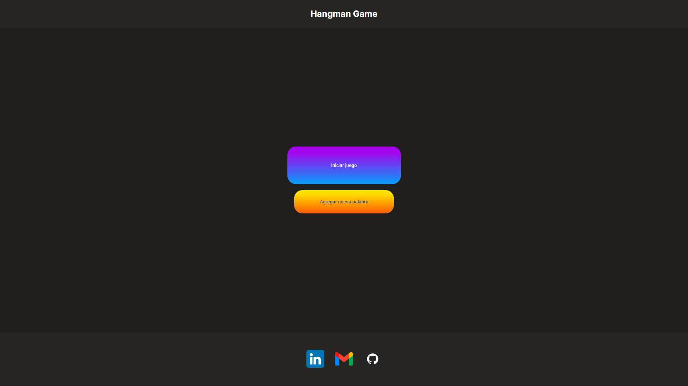
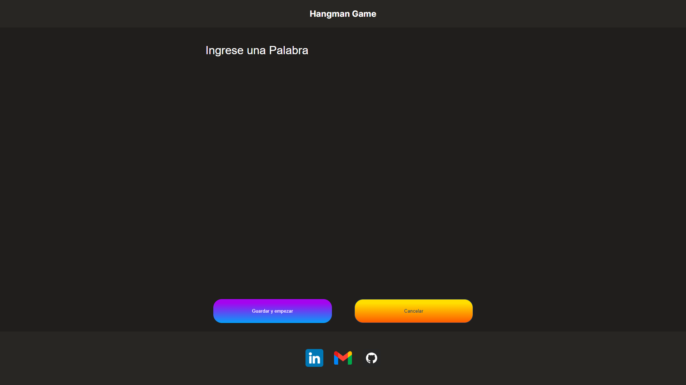

# Hangman Game

## About Hangman Game

 Hangman is a guessing game where one player has to think a word, phrase or sentence and another player tries to guess it by suggesting letters with a set number of tries.
The word to guess is represented by a row of dashes representing each letter of the word. If the player suggests a letter which occurs in the word, the other player writes it in all correct positions. If the suggested letter is not occur in the word, the other player draws one element of a hanged stick figure as a tally mark.

## About of the project.

This project is a challenge proposed by Alura Latam due to the Oracle Next Education program. The requierement of this challenge are the following:

- It must to work only with capital letters
- It must not to be used letters with special characters
- When completing the hangman drawing It must to show a message "Game Over" in the screen
- If the correct word is completed before the attempts are over, It must to show a message "Congratulation, You've won" in the screen.
- To begin the game the page must to have a button of "Start Game"
- It must'nt be possible write numbers within the game
- The wrong letters must be to display in the screen, but they can't appear repeatedly.
- The correct letters must appear in the screen above the dashes, in the correct position

### Extra
- The page must to have a text input field with the aim of add a new word, and a button "Add Word" 

## How to use it
It's a simple web page that was built using HTML5, CSS3 and JavaScript. The home page has two button, the start game button allows the user to play directly, while that the add word button allows to add a word. The image below shows the window of add word.

When add a new word, the page randomly choose a word and generate the dashes with the number of letter of the word chosen. the image below shows the window with the dashed generated.

When a wrong letter is introduced in this page, the letter is showed below of dashes and a segment of the stick figure appear in the screen.

Finally, a window appears depending if the player win or lost the game.

## Responsive Design

This project was realized using the methology "Mobile First", thus first this we page was built in mobile format. Next, the images corresponding to the mobile format will be display:

    
    
    
    
    

